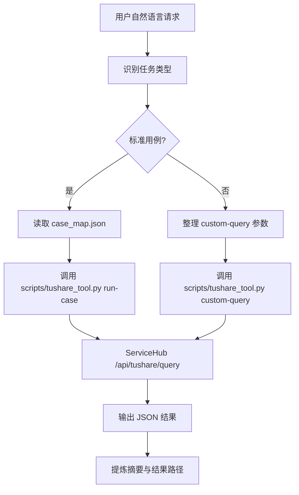

# skill-tushare-servicehub-assistant

`skill-tushare-servicehub-assistant` 是一个单入口 TuShare 技能包，用于在 Claude Code / OpenCode 环境中通过 ServiceHub 的 TuShare 中转接口，统一执行标准测试用例、获取结构化股票数据，并输出兼容 TuShare 接口文档回写流程的标准 JSON 结果。

它不是 18 个独立技能的集合，而是一个“对话式技能包”：

1. 用户只描述自然语言需求
2. AI 助手判断要执行哪个内置用例或哪个自定义接口
3. 如果缺少凭证或关键参数，AI 助手主动追问
4. 如果涉及批量或自定义高风险调用，AI 助手先确认
5. 然后再调用统一脚本 `scripts/tushare_tool.py`

## 能力范围

1. 执行 18 个内置 TuShare 标准测试用例
2. 输出标准 JSON 证据文件，兼容接口文档回写流程
3. 通过 ServiceHub 发起受控自定义 TuShare 查询
4. 列出可用用例清单与默认参数
5. 统一返回积分余额、扣点与交易单号
6. 默认先查本地缓存数据库，再决定是否远程查询
7. 按 4 类主要业务场景组织分析流程，而不是要求用户记忆底层接口

## 推荐交互方式

适合的用户说法例如：

- `帮我跑一下 stock_basic 的测试用例`
- `执行 income 和 cashflow 两个标准用例`
- `有哪些内置的 TuShare 用例`
- `帮我通过 ServiceHub 查 daily，ts_code 是 000001.SZ`
- `先给我生成 stock_basic 的标准 JSON，后面我要回写 TuShare 接口文档`
- `我想看一下平安银行最近三个月的市场行情`
- `帮我基于近三年及最近一期财务数据看一下宁德时代的财务情况`

## Mermaid 业务流程图



## 目录结构

```text
skill-tushare-servicehub-assistant/
├─ SKILL.md
├─ README.md
├─ INSTALL.md
├─ .env.example
├─ .gitignore
├─ requirements.txt
├─ commands/
│  └─ skill-tushare-servicehub-assistant.md
├─ data/
│  └─ .gitkeep
├─ references/
│  ├─ api_spec.md
│  ├─ case_map.json
│  ├─ case_catalog.md
│  ├─ local_data_architecture.md
│  ├─ usage_scenarios.md
│  └─ writeback_workflow.md
└─ scripts/
   └─ tushare_tool.py
```

## 获取与安装

```bash
git clone https://github.com/JasonCai2024/skill-tushare-servicehub-assistant.git
cd skill-tushare-servicehub-assistant
pip install -r requirements.txt
```

复制到技能目录时，保持整个文件夹为一个独立技能包目录。

## 凭证安全与隔离规范

禁止在仓库中硬编码任何真实账号、密码、token。

推荐凭证来源优先级：

1. 命令行参数
2. 环境变量
3. `data/credentials.json`

优先环境变量：

- `TUSHARE_SERVICEHUB_USERNAME`
- `TUSHARE_SERVICEHUB_PASSTOKEN`

兼容变量：

- `SERVICEHUB_USERNAME`
- `SERVICEHUB_PASSTOKEN`
- `SERVICETUBER_USERNAME`
- `SERVICETUBER_PASSTOKEN`

如果使用 `.env`，可从 `.env.example` 复制后填写。

## 本地数据复用

技能包默认把查询结果写入两层本地 SQLite 数据库：

- 缓存层：`data/tushare_cache.db`
- 业务仓库层：`data/tushare_warehouse.db`

默认策略：

1. 先查本地业务仓库
2. 再查本地缓存
3. 未命中再走 ServiceHub
4. 远程成功后同时写回缓存层和业务仓库层
5. 若用户明确要求最新数据，再使用 `--refresh`
6. 若只允许本地读取，可使用 `--cache-only`

本地业务仓库支持通过 `warehouse-query` 按场景读取，例如：

```bash
python scripts/tushare_tool.py warehouse-query --scenario finance --identifier 贵州茅台
python scripts/tushare_tool.py warehouse-query --scenario market --identifier 600519.SH --limit 30
```

如果希望“本地缺口自动补数，再输出场景结果”，可使用：

```bash
python scripts/tushare_tool.py scenario-query --scenario finance --identifier 贵州茅台
python scripts/tushare_tool.py scenario-query --scenario market --identifier 平安银行 --days 90
```

`scenario-query` 和 `warehouse-query` 的返回中都会附带：

1. `summary`：面向用户的中文摘要
2. `sync_actions`：哪些数据已命中本地，哪些仍有缺口待补

## 核心设计决策

1. 技能包只有一个入口，内部路由 18 个测试用例与自定义查询，不拆成 18 个独立技能。
2. 所有 TuShare 调用都通过 ServiceHub 中转，不直连 TuShare 官方接口。
3. 标准测试用例配置集中放在 `references/case_map.json`，便于维护。
4. 主业务场景分析规则集中放在 `references/usage_scenarios.md`，避免把流程拆散到对话里。
5. 文档回写相关规则集中放在 `references/writeback_workflow.md`，避免堆进 `SKILL.md`。
6. 脚本负责稳定执行、缓存落盘、业务仓库落盘和 JSON 输出，技能正文负责对话路由和决策规则。
